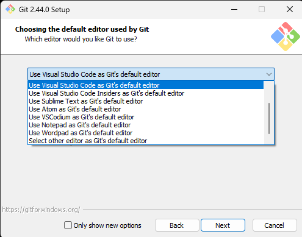

# Git Kurulumu

Git'i [bu linkten](https://git-scm.com/downloads) sisteminize uygun olanı seçerek indirebilir veya winget kullanmak isterseniz

```bat
winget install --id Git.Git -e --source winget --interactive
```

komutu ile indirme işlemini gerçekleştirebilirsiniz.

Setup dosyasını açtıktan sonra veya winget indirme işlemini tamamladıktan sonra karşınıza böyle bir ekran çıkacaktır.


Next seçeneğini seçip bir sonraki ekrana geçmeniz gerekmektedir.


Bu alana geldiğinizde kırmızı ile işaretli olan 2 seçenek ekranınız tercihinize kalmış bir şeydir.

Sağ tıkladığınızda bu tarz tuşlar ile karşılaşmak istemiyorsanız görseldeki gibi seçenekleri kaldırmanız gerekmektedir.


Son olarak değiştirmeniz gereken önerdiğimiz ayar ise Git programı için varsayılan editörü Visual Studio Code olarak belirlemektir.



Resimde göründüğü gibi Visual Studio Code seçeneğini işaretlemeniz yeterli olacaktır.

Geri kalan kurulum boyunca herhangi bir seçeneği değiştirmediğinizden emin olup Next seçeneğini ile kuruluma devam edin.

Kurulum işlemini tamamladığınızda Git programının başarılı bir şekilde kurulduğundan emin olmanız gerekmektedir.

Yeni bir konsol açtıktan sonra

```bat
git version
```

yazdıktan sonra kurduğunuz Git programının versiyonu ile karşılaşmanız gerekmektedir.


Yazdığınız takdirde eğer versiyon çıktısı ile karşılaşmıyorsanız bunun birkaç sebebi olabilir;

1. Kurulum esnasında açık bir konsol üzerinden komutları denemişsinizdir.

   Çözümü: Açık tüm konsolları kapatıp yeni bir konsol üzerinden denemek bu sorunu çözecektir.

2. Kurulum esnasında path ekleme sorunu yaşanmış olabilir.

   Çözümü: Lütfen bilgisayarınızı yeniden başlattıktan sonra deneyin.

Üstteki sorunlar ile karşılaşıp yine bir sonuca ulaşamadıysanız lütfen kurulumu tekrar gerçekleştirin.
