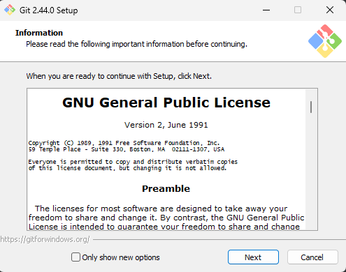
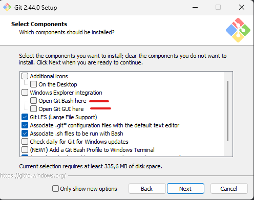
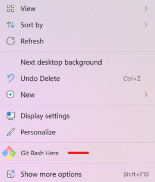

# Git Kurulumu

Git'i [bu linkten](https://git-scm.com/downloads) sisteminize uygun olanı seçerek indirebilir veya winget kullanmak isterseniz

```
winget install --id Git.Git -e --source winget
```

komutu ile indirme işlemini gerçekleştirebilirsiniz.

Setup dosyasını açtıktan sonra veya winget indirme işlemini tamamladıktan sonra karşınıza böyle bir ekran çıkacaktır.



Next seçeneğini seçip bir sonraki ekrana geçmeniz gerekmektedir.



Bu alana geldiğinizde kırmızı ile işaretli olan 2 seçenek ekranınız tercihinize kalmış bir şeydir.

Sağ tıkladığınızda bu tarz tuşlar ile karşılaşmak istemiyorsanız görseldeki gibi seçenekleri kaldırmanız gerekmektedir.



Geri kalan kurulum boyunca herhangi bir seçeneği değiştirmediğinizden emin olup Next seçeneğini ile kuruluma devam edin.

Kurulum işlemini tamamladığınızda Git programının başarılı bir şekilde kurulduğundan emin olmanız gerekmektedir.

Konsol kısmına

```
git version
```

yazdıktan sonra kurduğunuz Git programının versiyonu ile karşılaşmanız gerekmektedir.


Yazdığınız takdirde eğer versiyon çıktısı ile karşılaşmıyorsanız lütfen bilgisayarınızı yeniden başlattıktan sonra deneyin.

Yeniden başlatma sonrası değişen bir şey yoksa kurulumu tekrar gerçekleştirin.
